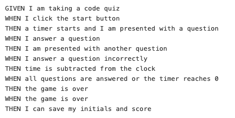

# code_quiz

## Installation/Deployment

Open the html file in the browser. Another option is to go to this link: <https://github.com/skimmers/code_quiz> and examine the html, css, and javascript files.

Please check to see if the assignment goals are met.

## Goal

The goal is to create a timed quiz. Whenever a wrong answer is chosen the timer decreases time. After one completes the quiz, they'll have the option to post their name on the leader board.

These are the requirements I had to meet: 

## My Quiz

Please see a demonstration of my quiz

# Purpose

I believe the purpose of this assignment was to test my abilities in CSS, HTML and JavaScript. It was a good exercise to see how all the languages connected and worked together to create a product. 

This assignment was extremely challenging but it did boost my confidence in my ability to code a little. However, I am still struggling to understand JavaScript.
